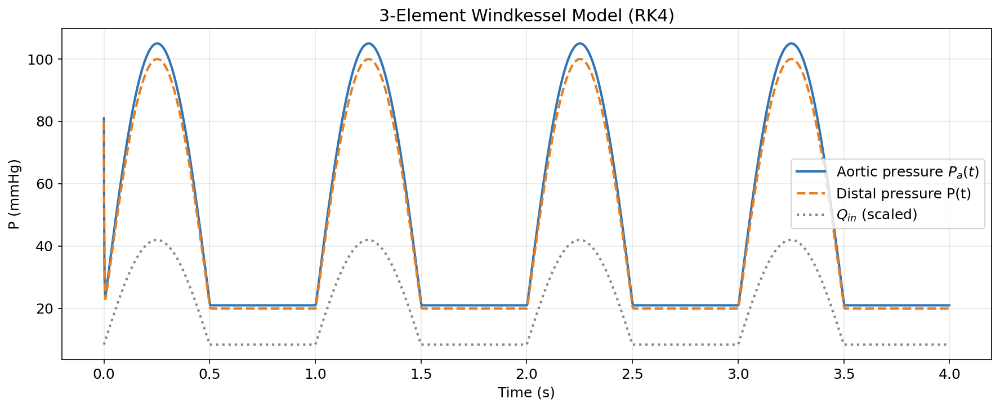
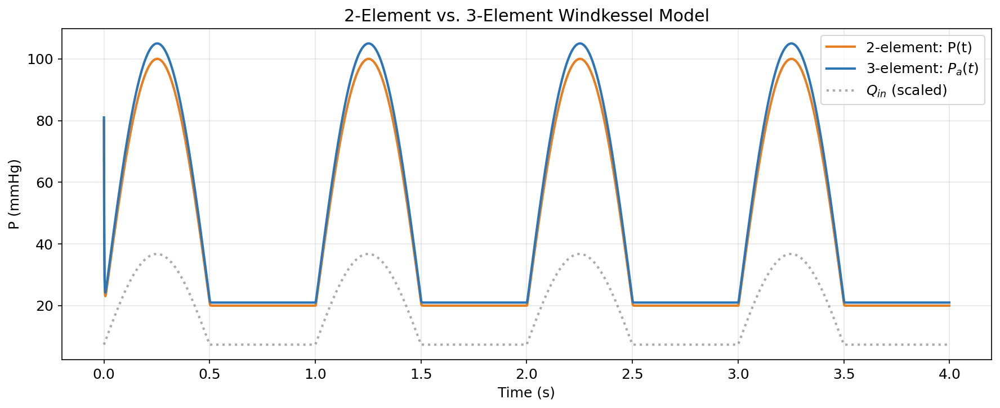
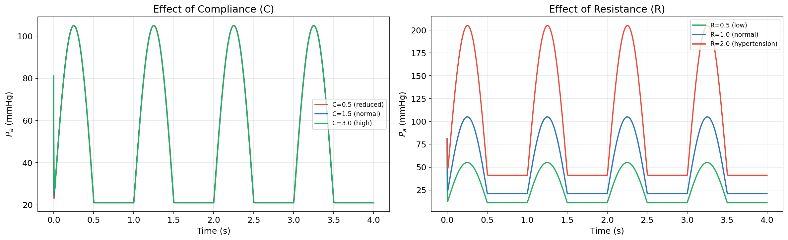
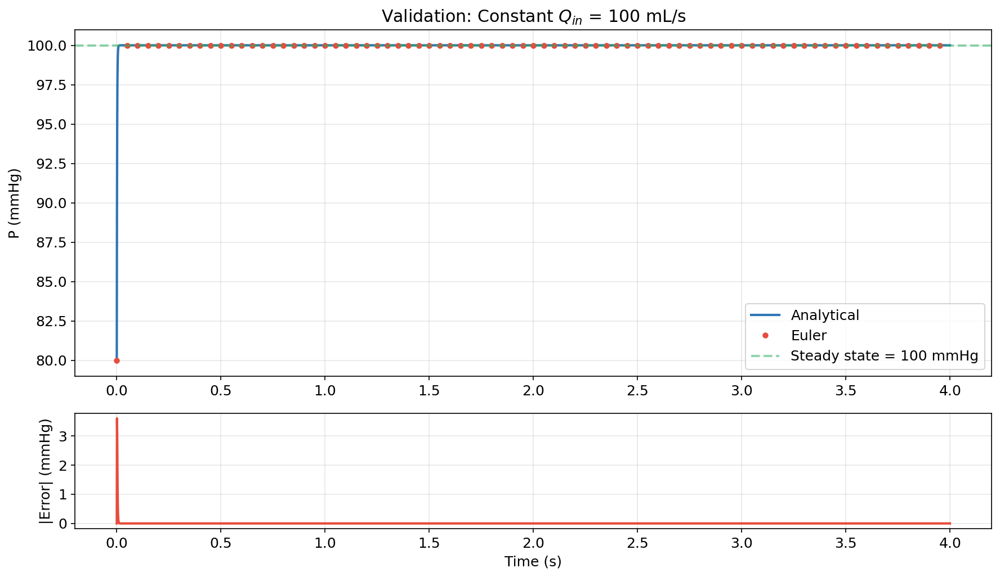

# Windkessel Model: Mathematical Modeling of Arterial Blood Pressure

Mathematical modeling of arterial blood pressure dynamics using 2-element and 3-element Windkessel models, solved with ordinary differential equations.



## Overview

The **Windkessel effect** describes how elastic arteries smooth out the pulsatile cardiac output into more continuous blood flow. This project models this phenomenon using an electrical circuit analogy:

| Cardiovascular System | Electrical Equivalent |
|---|---|
| Heart (pumping) | Current source |
| Arterial elasticity | Capacitor |
| Peripheral resistance | Resistor |
| Blood pressure | Voltage |
| Blood flow | Current |

Two models are implemented:

- **2-element model** (R, C) — captures exponential pressure decay during diastole
- **3-element model** (R₁, R₂, C) — adds aortic impedance for realistic systolic pressure peaks

## Key Results

### Model Comparison

The 3-element model (blue) captures the sharp systolic pressure rise that the 2-element model (orange) misses:



### Parameter Sensitivity

Reduced arterial compliance (aging/atherosclerosis) increases pulse pressure; elevated peripheral resistance (hypertension) raises mean arterial pressure:



### Numerical Validation

Euler method numerical solution matches the analytical solution for constant input flow with error on the order of 10⁻³ mmHg:



## Repository Structure

```
windkessel-model/
├── notebooks/
│   └── windkessel_model.ipynb   # Full analysis notebook (text + code + plots)
├── src/
│   └── windkessel.py            # Reusable model functions (Euler, RK4, analytical)
├── figures/                     # Generated plots
├── docs/
│   └── seminarski_rad.tex       # Original seminar paper (Serbian, LaTeX)
├── generate_figures.py          # Regenerate all figures
├── requirements.txt
└── README.md
```

## Quick Start

```bash
git clone https://github.com/savanoviczorana/windkessel-model.git
cd windkessel-model
pip install -r requirements.txt
jupyter notebook notebooks/windkessel_model.ipynb
```

Or use the model directly in Python:

```python
from src.windkessel import pulsatile_flow, windkessel_3elem_rk4, DEFAULT_PARAMS
import numpy as np

p = DEFAULT_PARAMS
t = np.arange(0, p['tmax'], p['dt'])
Qin = pulsatile_flow(t)

P_distal, P_aortic = windkessel_3elem_rk4(t, Qin, R1=0.05, R2=1.0, C=1.5e-3, P0=80.0)
```

## Mathematical Background

### Governing ODE (2-element)

$$\frac{dP}{dt} = \frac{1}{C}\left(Q_{in}(t) - \frac{P}{R}\right)$$

**Analytical solution** for constant $Q_{in}$ with initial condition $P(0) = P_0$:

$$P(t) = Q_{in} \cdot R + (P_0 - Q_{in} \cdot R) \cdot e^{-t/(RC)}$$

### 3-element extension

The measured aortic pressure adds the voltage drop across the characteristic impedance:

$$P_a(t) = P(t) + R_1 \cdot Q_{in}(t)$$

### Numerical methods

- **Euler method** — first-order, error ∝ Δt
- **Runge-Kutta 4th order (RK4)** — fourth-order, error ∝ Δt⁴

## Parameters

| Parameter | Symbol | Unit | Typical Value | Clinical Relevance |
|---|---|---|---|---|
| Peripheral resistance | R | mmHg·s/mL | 0.8–1.2 | ↑ in hypertension |
| Characteristic impedance | R₁ | mmHg·s/mL | 0.03–0.1 | Aortic stiffness |
| Arterial compliance | C | mL/mmHg | 1.0–2.0 | ↓ with aging |

## References

1. Frank, O. "Die Grundform des Arteriellen Pulses." *Zeitschrift für Biologie*, 37, 483–526, 1899.
2. Westerhof, N., et al. "The arterial Windkessel." *Med Biol Eng Comput*, 47, 131–141, 2009.
3. Boyce, W. E. & DiPrima, R. C. *Elementary Differential Equations and Boundary Value Problems.* Wiley, 2009.

## License

MIT
