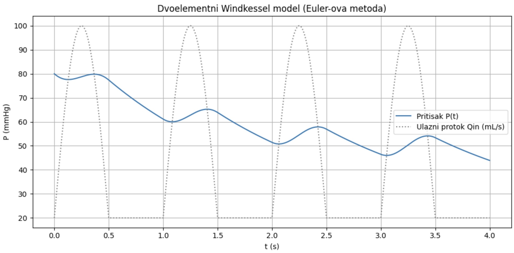
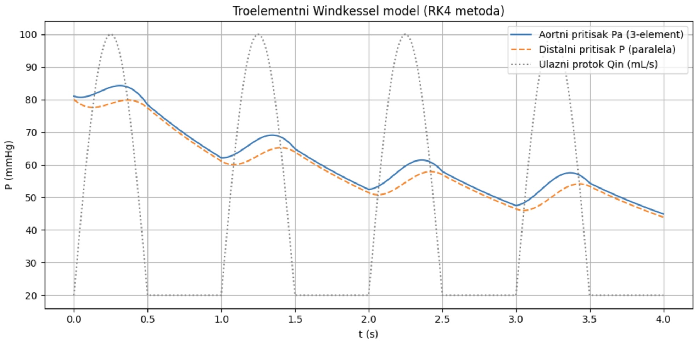
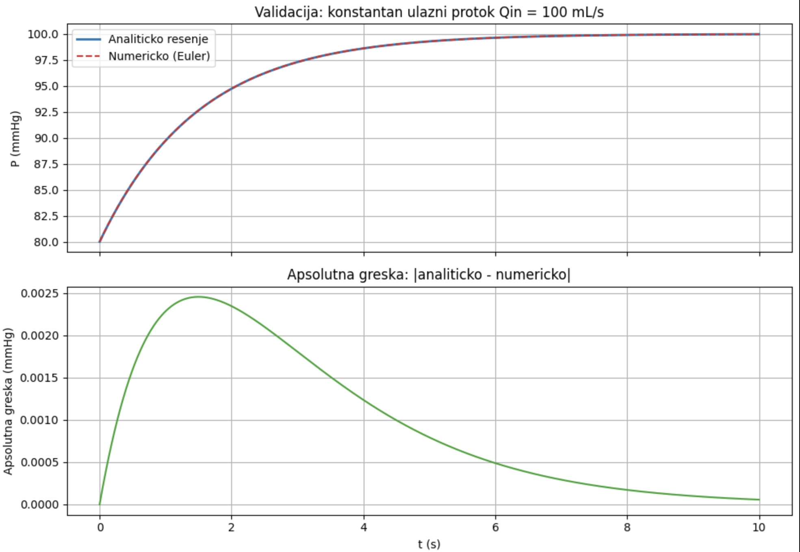
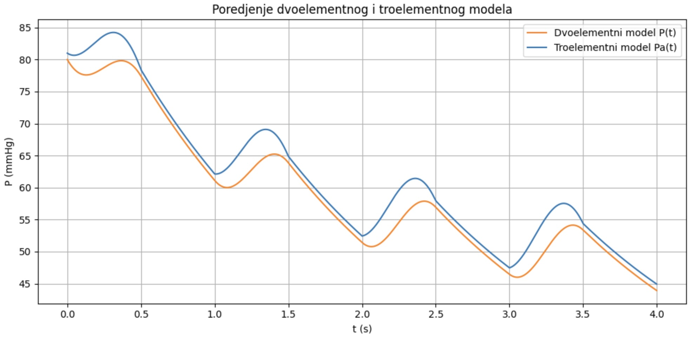
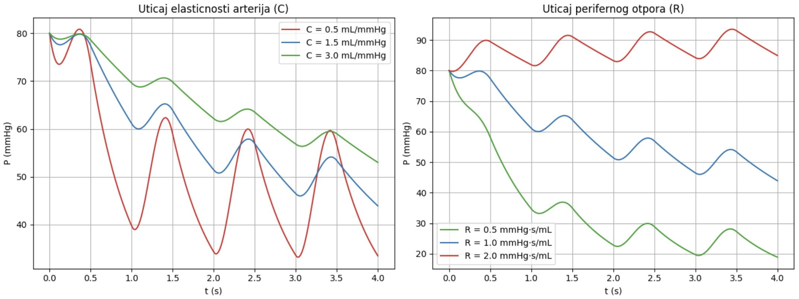

# Windkessel model — matematičko modelovanje arterijskog pritiska

> Seminarski rad iz predmeta *Modeliranje dinamičkih sistema*.
> Modelovanje dinamike arterijskog pritiska pomoću dvoelementnog i troelementnog Windkessel modela, sa numeričkim simulacijama u Pythonu (Eulerova i Runge–Kutta metoda).

## Pregled rezultata

### Dvoelementni model
Pritisak prati pulsni ulazni protok; tokom dijastole opada eksponencijalno.

### Troelementni model
Dodatni otpor R1 daje oštrije sistoličke vrhove, bliže stvarnim merenjima.

### Validacija
Numeričko rešenje (Euler) poklapa se sa analitičkim za konstantan protok.

### Poređenje modela

### Analiza osetljivosti parametara
Uticaj elastičnosti C i perifernog otpora R na krivu pritiska.

## O modelu

Windkessel model koristi analogiju između krvotoka i električnog kola:

| Fiziološka veličina | Električni analog | Simbol |
|---|---|---|
| Elastičnost arterija | Kondenzator | C |
| Periferni otpor | Otpornik | R |
| Karakteristična impedansa aorte | Serijski otpornik | R1 |
| Ulazni protok iz srca | Izvor struje | Qin(t) |

Osnovna jednačina (dvoelementni model):

$$C \frac{dP}{dt} + \frac{P}{R} = Q_{in}(t)$$

## Sadržaj

- `doc/` — seminarski rad (LaTeX izvor i PDF)
- `notebook/` — Jupyter notebook sa svim simulacijama
- `figures/` — slike korišćene u radu

## Pokretanje

    pip install numpy matplotlib jupyter
    jupyter notebook notebook/windkessel_simulacije.ipynb

## Kompajliranje rada

    cd doc
    pdflatex windkessel.tex
    pdflatex windkessel.tex

## Autor

Zorana Savanović — Prirodno-matematički fakultet, Univerzitet u Novom Sadu